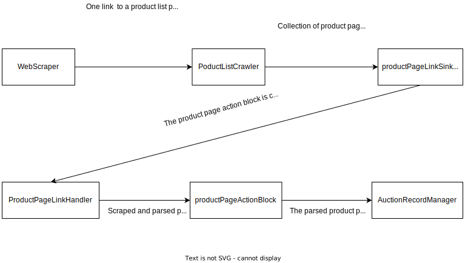

Back to [readme](../README.md).

---

# Web Scraper Program Documentation

This application consists of 5 projects/modules:
- [Web Scraper Program Documentation](#web-scraper-program-documentation)
  - [Application](#application)
  - [Downloader](#downloader)
  - [WebScraper - module](#webscraper---module)
    - [Jobs](#jobs)
    - [WebScraping and processing](#webscraping-and-processing)
  - [ProjectListCrawler](#projectlistcrawler)
  - [MailSender](#mailsender)
  - [WebScraperTests](#webscrapertests)

The lifetime of this application can be divided into parts:

- The configuration of the application

## Application

The application is the main startup project, it is responsible for the configuration of the application ([EmailNotifier](../Application/Notifications/EmailNotifier.cs), [WebScraperConfiguration](../WebScraper/Configuration/WebScraperConfiguration.cs)) and the startup of the web scraper.

It uses [Spectre.Console](https://spectreconsole.net/) for the configuration guide and [System.Text.Json.JsonSerializer](https://learn.microsoft.com/en-us/dotnet/api/system.text.json.jsonserializer?view=net-7.0) for the serialization and deserialization of the configuration.

After the configuration process, the application starts the web scraper, which is implemented as [IHostedService](https://learn.microsoft.com/en-us/dotnet/api/microsoft.extensions.hosting.ihostedservice?view=dotnet-plat-ext-7.0).

For details see [Program.cs](../Application/Program.cs).

## Downloader

The downloader is a module that is responsible for downloading the web pages, it is implemented as a [HttpClient](https://docs.microsoft.com/en-us/dotnet/api/system.net.http.httpclient?view=net-5.0) wrapper and it uses [HAP](https://html-agility-pack.net/) to parse the incomming HTML.

## WebScraper - module

The web scraper module is the core of this application, it is responsible for the scraping of the web pages, processing of the scraped data and storing the data in the database. The scraping is configured by the [WebScraperConfiguration](../WebScraper/Configuration/WebScraperConfiguration.cs) class, which is passed to the constructor of the web scraper's [Startup](../WebScraper/Startup.cs) class. For running the web scraper as a hosted service, use the configured `Startup` class to configure an instance of [IHostBuilder](https://learn.microsoft.com/en-us/dotnet/api/microsoft.extensions.hosting.ihostbuilder?view=dotnet-plat-ext-7.0).

### Jobs
The web scraper is based on the [Quartz.NET](https://www.quartz-scheduler.net/) library, which is a job scheduling library for .NET. The Quartz runs 3 types of jobs:

- [ScrapeAuctionListsJob](../WebScraper/JobScheduling/ScrapeAuctionListsJob.cs) - scrapes the auction lists and stores the scraped data in the database. It uses an configured instance of [WebScraper](../WebScraper/WebScraper.cs) class to scrape the data. More about this [later](#webscraping-and-processing).
- [AuctionEndingUpdateJob](../WebScraper/JobScheduling/AuctionEndingUpdateJob.cs) - it is scheduled for every auction record created, it should update the stored data before the auction ends (mainly the current price).
- [DeleteOldRecordsJob](../WebScraper/JobScheduling/DeleteOldRecordsJob.cs) - deletes records, which represent auctions that ended before more than configured number of days, from the database using an instance of [IUnitOfWork](../WebScraper/Persistence/UnitOfWork/IUnitOfWork.cs) and an instance of [IAuctionRecordRepository](../WebScraper/Persistence/AuctionRecord/IAuctionRecordRepository.cs). This job is started once a day.


### WebScraping and processing

When the `WebScraper.ScrapeAsync` method is called, it starts the scraping process. The scraping process can be described in short as:
- Create `productPageLinkSink` - a buffer block that is connected to an action block, that processes the links to the product pages.
- For each link in the [ScrapingJobDefinition](../WebScraper/Scraping/ScrapingJobDefinition.cs) call the `IProductListCrawler.Crawl(Uri productListStart, IProductListProcessor processor, ITargetBlock<IReadOnlyCollection<Uri>> productPageTarget, CancellationToken token)` method to crawl the product list page and send the product page links to the `productPageLinkSink`.
- When the `productPageLinkSink` receives a collection of product page links from the product list crawler, it creates an instance of `IUnitOfWork` - unit of work and `productPageActionBlock`, which is used to dose parsed product pages one at a time to an [IAuctionRecordManager](../WebScraper/Persistence/AuctionRecord/IAuctionRecordManager.cs) contained in the unit of work. The collection of the received product page links is passed to an instance of [IProductPageLinkHandler](../WebScraper/Scraping/IProductPageLinkHandler.cs) through its method 
  ```C#
  HandleLinksAsync(
        IEnumerable<Uri> links,
        ITargetBlock<ProductPageParsingResult> targetBlock,
        CancellationToken cancellationToken);
  ```
  The `productPageActionBlock` is used as the `targetBlock` parameter of the `HandleLinksAsync` method. After the `productPageActionBlock` is completed, the unit of work is completed, which in the default implementation means that the `SaveChanges` method of the [database context](../WebScraper/Persistence/ScraperDbContext.cs). The database context is derived from the abstract `DbContext` class that comes from [Entity Framework Core](https://learn.microsoft.com/en-us/ef/core/). EF core is used to create the database and to store the scraped data in it.
- When the `AuctionRecordManager` gets the newly scraped record, it is compared with the record that is already in the database. If the record is not in the database, it is added to the database and an `AuctionEndingUpdateJob` is scheduled for it. If the record is already in the database as a record of already ended auction, a notification about a readdition is sent, then the record is updated and the `AuctionEndingUpdateJob` is rescheduled for it.



## ProjectListCrawler

This module is responsible for crawling the auction lists, it uses an instance of [IProductListProcessor](../ProductListCrawler/IProductListProcessor.cs) to process a product list page and get the address of the next product list page and the links to the product pages. The product pages are sent to a target block ([ITargetBlock](https://learn.microsoft.com/en-us/dotnet/api/system.threading.tasks.dataflow.itargetblock-1?view=net-7.0)).

The defualt implementation of the `IProductListCrawler` is [ProductListCrawler](../ProductListCrawler/ProductListCrawler.cs).

## MailSender

This module is responsible for sending emails, it uses [MailKit](https://github.com/jstedfast/MailKit) for sending emails and [MimeKit](https://github.com/jstedfast/MimeKit) for creating the email message.

It is not directly used by the WebScraper module, but it is used by the [EmailNotifier](../Application/Notifications/EmailNotifier.cs) class, which is instantiated by the [Application](#application) module and passed to the `WebScraper.Startup` class.

## WebScraperTests

This module contains integration/unit tests for the WebScraper and Application module.

The tests require [Docker](https://www.docker.com/) to be running on the machine, because the tests use a [Testcontainers.MsSql nuget](https://www.nuget.org/packages/Testcontainers.MsSql) package to run a SQL Server instance in a docker container. See [WebScraperTests](../WebScraperTests/WebScraperTests.cs).

The email notification functionality is demonstrated and tested in [EmailNotificationTests](../WebScraperTests/EmailNotificationTests.cs).

---

Back to [readme](../README.md).